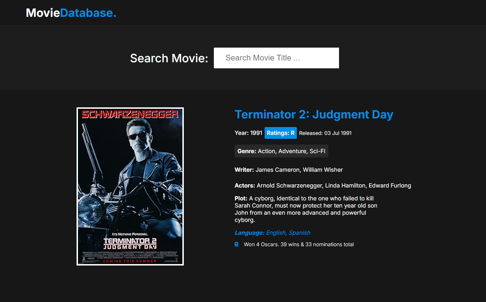
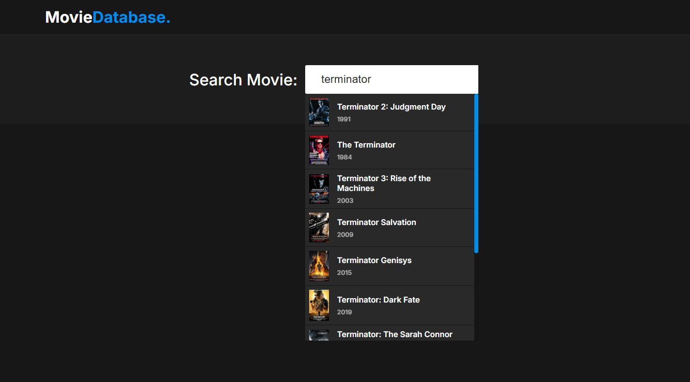

# Movie Search App




## Description
**Movie Search App** is a web application that allows users to search for movie information using an external API. With an intuitive and responsive interface, the app makes it easy to search for titles, movie details and other relevant information.

## Technologies Used
- **Frontend:** HTML, JavaScript and CSS
- **Movie API:** <a href="https://www.omdbapi.com/">OMDb API</a>

## Features
- Movie search by title
- Display of film details (year, synopsis, cast, etc.)
- Responsive and user-friendly interface

## How to Execute the Project
1. Clone this repository:
   ```bash
   git clone https://github.com/FelipeSDS23/Movie-Search-App.git
   ```
2. Open the `index.html` file in your browser.
4. To use the application, enter your API key in the constant `OMDB_API_KEY` located in the first line of the script.js file.
   - The key can be generated at: [OMDb API Key](https://www.omdbapi.com/apikey.aspx)


# Movie Search App

## Descrição
O **Movie Search App** é uma aplicação web que permite aos usuários pesquisar informações sobre filmes utilizando uma API externa. Com uma interface intuitiva e responsiva, o app facilita a busca por títulos, detalhes dos filmes e outras informações relevantes.

## Tecnologias Utilizadas
- **Frontend:** HTML, JavaScript e CSS
- **API de Filmes:** <a href="https://www.omdbapi.com/">OMDb API</a>

## Funcionalidades
- Pesquisa de filmes por título
- Exibição de detalhes do filme (ano, sinopse, elenco, etc.)
- Interface responsiva e amigável

## Como Executar o Projeto
1. Clone este repositório:
   ```bash
   git clone https://github.com/FelipeSDS23/Movie-Search-App.git
   ```
2. Abra o arquivo `index.html` em seu navegador.
4. Para usar a aplicação, insira sua chave de API na constante `OMDB_API_KEY` localizada na primeira linha do arquivo script.js.
   - A chave pode ser gerada em: [OMDb API Key](https://www.omdbapi.com/apikey.aspx)